# 📖 Guardian Wiki: `sktime-main`

> Auto-generated by **Agentic Dev Guardian** on 2026-03-31 06:47 UTC  
> Source: Live Memgraph AST graph for `/home/smayan/Downloads/sktime-main`

---

## 🗺️ Module Dependency Map

_Derived from `IMPORTS` edges in the Memgraph AST graph._

```mermaid
flowchart LR
    __init__["__init__"] --> __module__["__module__"]
    _deseasonalize["_deseasonalize"] --> __module__["__module__"]
    _estimator_html_repr["_estimator_html_repr"] --> __module__["__module__"]
    _kalman_filter["_kalman_filter"] --> __module__["__module__"]
    _metrics["_metrics"] --> __module__["__module__"]
    _minirocket_multivariate["_minirocket_multivariate"] --> __module__["__module__"]
    _paa["_paa"] --> __module__["__module__"]
    _pipeline["_pipeline"] --> __module__["__module__"]
    _placeholder["_placeholder"] --> __module__["__module__"]
    _reconcile["_reconcile"] --> __module__["__module__"]
    _safe_call["_safe_call"] --> __module__["__module__"]
    _sfa["_sfa"] --> __module__["__module__"]
    _shapelet_transform_numba["_shapelet_transform_numba"] --> __module__["__module__"]
    _test_vm["_test_vm"] --> __module__["__module__"]
    _version_bridge["_version_bridge"] --> __module__["__module__"]
    augmenter["augmenter"] --> __module__["__module__"]
    boxcox["boxcox"] --> __module__["__module__"]
    catch22["catch22"] --> __module__["__module__"]
    channel_selection["channel_selection"] --> __module__["__module__"]
    clasp["clasp"] --> __module__["__module__"]
    compose["compose"] --> __module__["__module__"]
    datetime["datetime"] --> __module__["__module__"]
    detection["detection"] --> __module__["__module__"]
    dobin["dobin"] --> __module__["__module__"]
    estimator_checks["estimator_checks"] --> __module__["__module__"]
    fh["fh"] --> __module__["__module__"]
    forecasting["forecasting"] --> __module__["__module__"]
    general["general"] --> __module__["__module__"]
    git_diff["git_diff"] --> __module__["__module__"]
    impute["impute"] --> __module__["__module__"]
    interpolate["interpolate"] --> __module__["__module__"]
    lag["lag"] --> __module__["__module__"]
    mlflow_sktime["mlflow_sktime"] --> __module__["__module__"]
    multiindex["multiindex"] --> __module__["__module__"]
    paa["paa"] --> __module__["__module__"]
    padder["padder"] --> __module__["__module__"]
    plotting["plotting"] --> __module__["__module__"]
    random_state["random_state"] --> __module__["__module__"]
    reduce["reduce"] --> __module__["__module__"]
    sampling["sampling"] --> __module__["__module__"]
    sax["sax"] --> __module__["__module__"]
    scaledlogit["scaledlogit"] --> __module__["__module__"]
    scenarios["scenarios"] --> __module__["__module__"]
    series["series"] --> __module__["__module__"]
    stats["stats"] --> __module__["__module__"]
    summarize["summarize"] --> __module__["__module__"]
    supervised_intervals["supervised_intervals"] --> __module__["__module__"]
    temporal_train_test_split["temporal_train_test_split"] --> __module__["__module__"]
    temporian["temporian"] --> __module__["__module__"]
    test_MiniRocketMultivariate["test_MiniRocketMultivariate"] --> __module__["__module__"]
    test_base["test_base"] --> __module__["__module__"]
    test_bkfilter["test_bkfilter"] --> __module__["__module__"]
    test_check_estimator["test_check_estimator"] --> __module__["__module__"]
    test_check_imports["test_check_imports"] --> __module__["__module__"]
    test_dependencies["test_dependencies"] --> __module__["__module__"]
    test_differencer["test_differencer"] --> __module__["__module__"]
    test_doctest["test_doctest"] --> __module__["__module__"]
    test_forecasting["test_forecasting"] --> __module__["__module__"]
    test_holidays["test_holidays"] --> __module__["__module__"]
    test_kalman_filter["test_kalman_filter"] --> __module__["__module__"]
    test_kinematic["test_kinematic"] --> __module__["__module__"]
    test_mlflow_sktime_model_export["test_mlflow_sktime_model_export"] --> __module__["__module__"]
    test_mstl["test_mstl"] --> __module__["__module__"]
    test_multiindex["test_multiindex"] --> __module__["__module__"]
    test_plotting["test_plotting"] --> __module__["__module__"]
    test_reconcile["test_reconcile"] --> __module__["__module__"]
    test_sax["test_sax"] --> __module__["__module__"]
    test_segmentation_metrics["test_segmentation_metrics"] --> __module__["__module__"]
    test_sklearn_df_adapt["test_sklearn_df_adapt"] --> __module__["__module__"]
    test_sliding_window_segmenter_transformer["test_sliding_window_segmenter_transformer"] --> __module__["__module__"]
    test_slope_transformer["test_slope_transformer"] --> __module__["__module__"]
    test_switch["test_switch"] --> __module__["__module__"]
    test_temporian["test_temporian"] --> __module__["__module__"]
    test_testscenarios["test_testscenarios"] --> __module__["__module__"]
    test_time_since["test_time_since"] --> __module__["__module__"]
    test_transformif["test_transformif"] --> __module__["__module__"]
    time_since["time_since"] --> __module__["__module__"]
    tsfresh["tsfresh"] --> __module__["__module__"]
```

---

## 🏛️ Class Inheritance Hierarchy

_Derived from `INHERITS_FROM` edges._

```mermaid
classDiagram
    TestScenario <|-- TransformerTestScenario
    BaseObject <|-- TransformerTestScenario
    TestScenario <|-- DetectorTestScenario
    BaseObject <|-- DetectorTestScenario
    ClassifierTestScenario <|-- ClassifierFitPredict
    _HeterogenousMetaEstimator <|-- TransformerPipeline
    BaseTransformer <|-- TransformerPipeline
    BaseTransformer <|-- FittedParamExtractor
    _ReconcilerTransformer <|-- MiddleOutReconciler
    BaseTransformer <|-- MiniRocketMultivariate
    BaseTransformer <|-- Detrender
    BaseTransformer <|-- SeasonalDummiesOneHot
    BaseTransformer <|-- LogTransformer
    BaseTransformer <|-- Filter
    BaseTransformer <|-- WindowSummarizer
    BaseTransformer <|-- Merger
    TestScenario <|-- ClustererTestScenario
    BaseObject <|-- ClustererTestScenario
    ClustererTestScenario <|-- ClustererFitPredictUnequalLengthOutOfSample
    TransformerFixtureGenerator <|-- TestAllTransformers
    QuickTester <|-- TestAllTransformers
    TransformerTestScenario <|-- TransformerFitTransformPanelUnivariateWithClassYOnlyFit
    ForecasterTestScenario <|-- ForecasterFitPredictUnivariateNoX
    TransformerPairwiseTestScenario <|-- TransformerPairwiseTransformSymm
    BaseTransformer <|-- TSBootstrapAdapter
    _HeterogenousMetaEstimator <|-- MultiplexRegressor
    _DelegatedRegressor <|-- MultiplexRegressor
    BaseTransformer <|-- TruncationTransformer
    BaseTransformer <|-- ColumnSelect
    BaseTransformer <|-- _LeadLag
    BaseTransformer <|-- SAX
    _BaseTag <|-- capability__sample_weight
    ForecasterTestScenario <|-- ForecasterFitPredictUnivariateNoXEarlyFh
    ClassifierTestScenario <|-- ClassifierFitPredictNumpy
    AlignerTestScenario <|-- AlignerMultipleUnivariateUnequal
    BaseForecaster <|-- MockUnivariateForecasterLogger
    _MockEstimatorMixin <|-- MockUnivariateForecasterLogger
    TransformerTestScenario <|-- TransformerFitTransformHierarchicalMultivariate
    ClustererTestScenario <|-- ClustererFitPredictUnequalLength
    AlignerTestScenario <|-- AlignerPairwiseUnivariateUnequal
    TransformerPairwiseTestScenario <|-- TransformerPairwiseTransformAsymm
    ClustererTestScenario <|-- ClustererFitPredictMultivariate
    BaseFixtureGenerator <|-- TransformerFixtureGenerator
    BaseTransformer <|-- RandomShapeletTransform
    TransformerTestScenario <|-- TransformerFitTransformHierarchicalUnivariate
    BaseTransformer <|-- _TransformChangeNInstances
    OptimalReconciler <|-- NonNegativeOptimalReconciler
    BaseTransformer <|-- ADICVTransformer
    BaseTransformer <|-- Differencer
    BaseTransformer <|-- FABBA
    BaseTransformer <|-- SqueezeHierarchy
    BaseTransformer <|-- SlidingWindowSegmenter
    BaseTransformer <|-- TimeBinner
    _AugmenterTags <|-- InvertAugmenter
    BaseTransformer <|-- InvertAugmenter
    _Window <|-- _ExpandingSliding
    BaseTransformer <|-- FinancialHolidaysTransformer
    BaseTransformer <|-- ScaledLogitTransformer
    BaseTransformer <|-- ThetaLinesTransformer
    BaseTransformer <|-- FourierFeatures
    BaseObject <|-- BaseSampleWeightGenerator
    _ReconcilerTransformer <|-- OptimalReconciler
    _BaseTag <|-- capability__distance_matrix
    BaseTransformer <|-- SFAFast
    _BaseTag <|-- requires_y_train
    BaseTransformer <|-- _PanelToPanelTransformer
    BaseTransformer <|-- TSInterpolator
    BaseTransformer <|-- Reconciler
    BaseTransformer <|-- SubsequenceExtractionTransformer
    BaseTransformer <|-- _AddTime
    BaseSplitter <|-- CutoffSplitter
    BaseTransformer <|-- STLBootstrapTransformer
    BaseTransformer <|-- BoxCoxTransformer
    _BaseTag <|-- capability__pred_int
    _BaseTag <|-- capability__inverse_transform
    BaseDeepRegressorTorch <|-- SimpleRNNRegressorTorch
    BaseSampleWeightGenerator <|-- RecencyWeightGenerator
    _HeterogenousMetaEstimator <|-- CombineTransformers
    BaseTransformer <|-- CombineTransformers
    BaseTransformer <|-- Catch22Wrapper
    _DummyRegressor <|-- _DummyComposite
    BaseTransformer <|-- ColumnConcatenator
    TransformerTestScenario <|-- TransformerFitTransformPanelUnivariateNumpyWithClassYOnlyFit
    _BaseTag <|-- capability__unequal_length__removes
    BaseFixtureGenerator <|-- ParamFitterFixtureGenerator
    BaseEstimator <|-- Pipeline
    _BaseTag <|-- n_timepoints_train
    _BaseTag <|-- tests__skip_all
    SplitterFixtureGenerator <|-- TestAllSplitters
    QuickTester <|-- TestAllSplitters
    BaseTransformer <|-- RandomIntervalFeatureExtractor
    _Window <|-- _Global
    BaseTransformer <|-- ReducerTransform
    BaseTransformer <|-- PCATransformer
    _BaseTag <|-- tests__python_dependencies
    _BaseTag <|-- n_datasets
    BaseSplitter <|-- Repeat
    _TslearnAdapter <|-- TimeSeriesSVRTslearn
    BaseRegressor <|-- TimeSeriesSVRTslearn
    BaseTransformer <|-- RandomIntervals
```



---

## 🔥 Top 3 Highest-Complexity Functions

_Ranked by outgoing `CALLS` edges (blast radius). These are the highest architectural risk points in the codebase._


**1. `forward`** — 109 outgoing calls  
`sktime/libs/granite_ttm/modeling_tinytimemixer.py`


**2. `forward`** — 92 outgoing calls  
`sktime/libs/timemoe/timemoe.py`


**3. `_fit`** — 63 outgoing calls  
`sktime/transformations/panel/shapelet_transform/_shapelet_transform.py`


---

## 📊 Function Call Graphs

### `forward`




### `forward`


```mermaid
flowchart TD
    forward["forward"] --> X_transpose["X.transpose"]
    forward["forward"] --> _safe_import["_safe_import"]
    forward["forward"] --> conv["conv"]
    forward["forward"] --> conv_outputs_append["conv_outputs.append"]
    forward["forward"] --> embed["embed"]
    forward["forward"] --> enumerate["enumerate"]
    forward["forward"] --> f_t_unsqueeze["f_t.unsqueeze"]
    forward["forward"] --> h_unsqueeze["h.unsqueeze"]
    forward["forward"] --> i_t_unsqueeze["i_t.unsqueeze"]
    forward["forward"] --> k_t_view["k_t.view"]
    forward["forward"] --> loc_float["loc.float"]
    forward["forward"] --> out_squeeze["out.squeeze"]
    forward["forward"] --> outputs_append["outputs.append"]
    forward["forward"] --> range["range"]
    forward["forward"] --> scale_float["scale.float"]
    forward["forward"] --> self_R_f["self.R_f"]
    forward["forward"] --> self_R_i["self.R_i"]
    forward["forward"] --> self_R_o["self.R_o"]
    forward["forward"] --> self_R_z["self.R_z"]
    forward["forward"] --> self_W_f["self.W_f"]
    forward["forward"] --> self_W_i["self.W_i"]
    forward["forward"] --> self_W_k["self.W_k"]
    forward["forward"] --> self_W_o["self.W_o"]
    forward["forward"] --> self_W_q["self.W_q"]
    forward["forward"] --> self_W_v["self.W_v"]
    forward["forward"] --> self_W_z["self.W_z"]
    forward["forward"] --> self__activation["self._activation"]
    forward["forward"] --> self__get_loc_scale["self._get_loc_scale"]
    forward["forward"] --> self_activation["self.activation"]
    forward["forward"] --> self_bn["self.bn"]
    forward["forward"] --> self_bottleneck["self.bottleneck"]
    forward["forward"] --> self_bottleneck_activation["self.bottleneck_activation"]
    forward["forward"] --> self_conv["self.conv"]
    forward["forward"] --> self_conv_from_maxpool["self.conv_from_maxpool"]
    forward["forward"] --> self_dropout["self.dropout"]
    forward["forward"] --> self_fc["self.fc"]
    forward["forward"] --> self_global_avg_pool["self.global_avg_pool"]
    forward["forward"] --> self_linear["self.linear"]
    forward["forward"] --> self_ln_f["self.ln_f"]
    forward["forward"] --> self_ln_i["self.ln_i"]
    forward["forward"] --> self_ln_k["self.ln_k"]
    forward["forward"] --> self_ln_k_self_W_k_x_t___view["self.ln_k(self.W_k(x_t)).view"]
    forward["forward"] --> self_ln_o["self.ln_o"]
    forward["forward"] --> self_ln_q["self.ln_q"]
    forward["forward"] --> self_ln_q_self_W_q_x_t___view["self.ln_q(self.W_q(x_t)).view"]
    forward["forward"] --> self_ln_v["self.ln_v"]
    forward["forward"] --> self_ln_v_self_W_v_x_t___view["self.ln_v(self.W_v(x_t)).view"]
    forward["forward"] --> self_ln_z["self.ln_z"]
    forward["forward"] --> self_maxpool["self.maxpool"]
    forward["forward"] --> self_maxpool_activation["self.maxpool_activation"]
    forward["forward"] --> self_output_activation["self.output_activation"]
    forward["forward"] --> self_position_embedding["self.position_embedding"]
    forward["forward"] --> self_temporal_embedding["self.temporal_embedding"]
    forward["forward"] --> self_tokenConv["self.tokenConv"]
    forward["forward"] --> self_tokenConv_x_permute_0__2__1___transpose["self.tokenConv(x.permute(0, 2, 1)).transpose"]
    forward["forward"] --> self_value_embedding["self.value_embedding"]
    forward["forward"] --> target_double["target.double"]
    forward["forward"] --> torch_bmm["torch.bmm"]
    forward["forward"] --> torch_cat["torch.cat"]
    forward["forward"] --> torch_exp["torch.exp"]
    forward["forward"] --> torch_max["torch.max"]
    forward["forward"] --> torch_ones_like["torch.ones_like"]
    forward["forward"] --> torch_rsqrt["torch.rsqrt"]
    forward["forward"] --> torch_sigmoid["torch.sigmoid"]
    forward["forward"] --> torch_sigmoid_self_W_f_x_t___view["torch.sigmoid(self.W_f(x_t)).view"]
    forward["forward"] --> torch_sigmoid_self_W_i_x_t___view["torch.sigmoid(self.W_i(x_t)).view"]
    forward["forward"] --> torch_tanh["torch.tanh"]
    forward["forward"] --> torch_zeros["torch.zeros"]
    forward["forward"] --> torchCat["torchCat"]
    forward["forward"] --> v_t_view["v_t.view"]
    forward["forward"] --> vk_flat_view["vk_flat.view"]
    forward["forward"] --> x_long["x.long"]
    forward["forward"] --> x_permute["x.permute"]
    forward["forward"] --> x_pow["x.pow"]
    forward["forward"] --> x_pow_2__mean["x.pow(2).mean"]
    forward["forward"] --> x_size["x.size"]
    forward["forward"] --> x_squeeze["x.squeeze"]
```

### `_fit`

```mermaid
flowchart TD
    _fit["_fit"] --> Parallel["Parallel"]
    _fit["_fit"] --> RandomIntervalSegmenter["RandomIntervalSegmenter"]
    _fit["_fit"] --> RuntimeError["RuntimeError"]
    _fit["_fit"] --> _check_index_no_total["_check_index_no_total"]
    _fit["_fit"] --> _get_g_matrix_bu["_get_g_matrix_bu"]
    _fit["_fit"] --> _get_g_matrix_ols["_get_g_matrix_ols"]
    _fit["_fit"] --> _get_g_matrix_td_fcst["_get_g_matrix_td_fcst"]
    _fit["_fit"] --> _get_g_matrix_wls_str["_get_g_matrix_wls_str"]
    _fit["_fit"] --> _get_s_matrix["_get_s_matrix"]
    _fit["_fit"] --> delayed["delayed"]
    _fit["_fit"] --> len["len"]
    _fit["_fit"] --> np_median["np.median"]
    _fit["_fit"] --> range["range"]
    _fit["_fit"] --> self__add_totals["self._add_totals"]
    _fit["_fit"] --> self__check_method["self._check_method"]
    _fit["_fit"] --> self__fit_setup["self._fit_setup"]
    _fit["_fit"] --> self__interval_segmenter_fit["self._interval_segmenter.fit"]
    _fit["_fit"] --> self_intervals__extend["self.intervals_.extend"]
    _fit["_fit"] --> stats_median_abs_deviation["stats.median_abs_deviation"]
    _fit["_fit"] --> z_normalise_series_3d["z_normalise_series_3d"]
    _fit["_fit"] --> zip["zip"]
    _get_g_matrix_bu["_get_g_matrix_bu"] --> X_droplevel["X.droplevel"]
    _get_g_matrix_bu["_get_g_matrix_bu"] --> X_droplevel_level__1__index_unique["X.droplevel(level=-1).index.unique"]
    _get_g_matrix_bu["_get_g_matrix_bu"] --> X_index_get_level_values["X.index.get_level_values"]
    _get_g_matrix_bu["_get_g_matrix_bu"] --> X_index_get_level_values_level__2__isin["X.index.get_level_values(level=-2).isin"]
    _get_g_matrix_bu["_get_g_matrix_bu"] --> X_loc___X_index_get_level_values_level__2__isin_____total_______________index_droplevel["X.loc[~(X.index.get_level_values(level=-2).isin(["__total"]))]
        .index.droplevel"]
    _get_g_matrix_bu["_get_g_matrix_bu"] --> X_loc___X_index_get_level_values_level__2__isin_____total_______________index_droplevel_level__1___________unique["X.loc[~(X.index.get_level_values(level=-2).isin(["__total"]))]
        .index.droplevel(level=-1)
        .unique"]
    _get_g_matrix_bu["_get_g_matrix_bu"] --> g_matrix_transpose["g_matrix.transpose"]
    _get_g_matrix_bu["_get_g_matrix_bu"] --> len["len"]
    _get_g_matrix_bu["_get_g_matrix_bu"] --> pd_DataFrame["pd.DataFrame"]
    _get_g_matrix_bu["_get_g_matrix_bu"] --> range["range"]
    _get_g_matrix_ols["_get_g_matrix_ols"] --> _get_s_matrix["_get_s_matrix"]
    _get_g_matrix_ols["_get_g_matrix_ols"] --> g_ols_set_index["g_ols.set_index"]
    _get_g_matrix_ols["_get_g_matrix_ols"] --> g_ols_transpose["g_ols.transpose"]
    _get_g_matrix_ols["_get_g_matrix_ols"] --> inv["inv"]
    _get_g_matrix_ols["_get_g_matrix_ols"] --> np_dot["np.dot"]
    _get_g_matrix_ols["_get_g_matrix_ols"] --> np_transpose["np.transpose"]
    _get_g_matrix_ols["_get_g_matrix_ols"] --> pd_DataFrame["pd.DataFrame"]
    _get_g_matrix_td_fcst["_get_g_matrix_td_fcst"] --> _get_g_matrix_bu["_get_g_matrix_bu"]
    _get_g_matrix_td_fcst["_get_g_matrix_td_fcst"] --> g_matrix_replace["g_matrix.replace"]
    _get_g_matrix_wls_str["_get_g_matrix_wls_str"] --> _get_s_matrix["_get_s_matrix"]
    _get_g_matrix_wls_str["_get_g_matrix_wls_str"] --> g_wls_str_set_index["g_wls_str.set_index"]
    _get_g_matrix_wls_str["_get_g_matrix_wls_str"] --> g_wls_str_transpose["g_wls_str.transpose"]
    _get_g_matrix_wls_str["_get_g_matrix_wls_str"] --> inv["inv"]
    _get_g_matrix_wls_str["_get_g_matrix_wls_str"] --> np_diag["np.diag"]
    _get_g_matrix_wls_str["_get_g_matrix_wls_str"] --> np_dot["np.dot"]
    _get_g_matrix_wls_str["_get_g_matrix_wls_str"] --> np_transpose["np.transpose"]
    _get_g_matrix_wls_str["_get_g_matrix_wls_str"] --> pd_DataFrame["pd.DataFrame"]
    _get_g_matrix_wls_str["_get_g_matrix_wls_str"] --> smat_sum["smat.sum"]
    _get_s_matrix["_get_s_matrix"] --> X_loc___X_index_get_level_values_level__2__isin_____total_______________index_droplevel_level__1___________unique["X.loc[~(X.index.get_level_values(level=-2).isin(["__total"]))]
        .index.droplevel(level=-1)
        .unique"]
```


---

## 📝 Architectural Decision Records (ADRs)

_AI-narrated ADRs for the highest-complexity functions, grounded in the Memgraph structural context._


### ADR: `forward`

## Status
Accepted

## Context
The `forward` function exists to handle the forward pass of a time series forecasting model, taking in past values and optional future values, observed masks, and other parameters to generate predictions. This function solves the problem of processing time series data for forecasting tasks.

## Decision
The `forward` function implements a modular and flexible architectural pattern, allowing for various input configurations and optional output features such as hidden states and custom return formats. This approach is chosen to accommodate different use cases and model requirements, enabling the function to be reused across various applications.

## Consequences
The implementation of the `forward` function introduces structural trade-offs, such as increased complexity due to the numerous optional parameters, which may lead to potential risks of incorrect usage or performance degradation if not properly optimized. Additionally, the function's flexibility may have downstream impacts on model interpretability and maintainability.


### ADR: `forward`

## Status
Accepted

## Context
The `forward` function exists to perform a forward pass through a neural network model, specifically a transformer-based architecture, to generate output based on given input sequences. This function solves the problem of propagating input data through the model to obtain predictions or representations.

## Decision
The `forward` function implements a modular and flexible architectural pattern, allowing for various input configurations and optional parameters to control the behavior of the model. This approach is chosen to accommodate different use cases and downstream tasks, such as language modeling, text classification, or sequence generation.

## Consequences
The implementation of the `forward` function introduces structural trade-offs, including increased complexity due to the numerous optional parameters, which may lead to potential risks of incorrect usage or performance degradation. Additionally, the function's flexibility may impact the model's interpretability and maintainability, requiring careful consideration of the downstream impacts on the overall system.


### ADR: `_fit`

## Status
Accepted

## Context
The `_fit` function exists to initialize the RandomShapeletTransform estimator by fitting it to the provided training data `X` and class values `y`, enabling the transformation of panel data into a suitable format for further analysis. This function solves the problem of preparing the data for shapelet transformation, which is crucial for time series classification tasks.

## Decision
The `_fit` function implements a data preprocessing and initialization pattern, utilizing techniques such as label encoding, data normalization, and parallel processing to optimize the shapelet transformation process. This approach is chosen to ensure efficient and accurate transformation of the data, leveraging libraries like joblib and numba for performance enhancements. The use of a dictionary to store class mappings also facilitates efficient class indexing.

## Consequences
The structural trade-offs of this implementation include potential performance bottlenecks due to the use of parallel processing, which may not be beneficial for small datasets. Additionally, the function's reliance on external libraries like joblib and numba may introduce compatibility risks or maintenance overhead. The downstream impact of this implementation is that it enables the RandomShapeletTransform estimator to be used for time series classification tasks, but may require careful tuning of hyperparameters like `n_jobs` and `max_shapelets` for optimal performance.


---

_End of Guardian Wiki_
